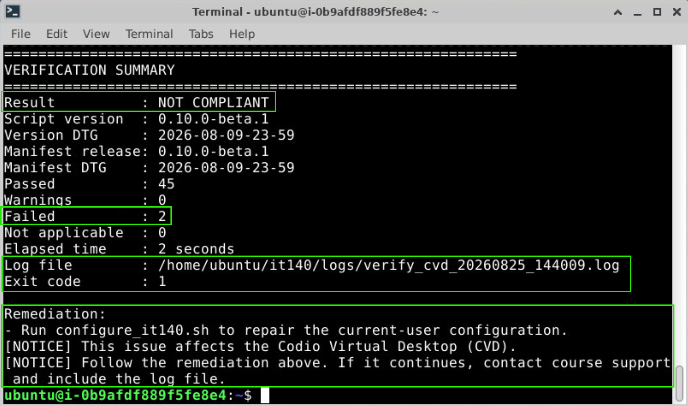

# IT 140 Service Desk Triage and Escalation Runbook

This runbook is for **SNHU IT Service Desk personnel** supporting IT 140 students and faculty.

This repository is written for faculty and staff. Students may be able to view it because it is public, but Service Desk operational guidance here is intended for F&S use.

Use this page as the starting point. You do **not** need to read the shared documentation first. Each procedure links to the shared course facts needed for that step.

> [!IMPORTANT]
> The Service Desk supports the **technical environment and access path** in which IT 140 work is completed.
>
> * **Faculty** handles graded requirements, grading, instructor feedback, and course decisions.
> * **Academic Support** can provide programming learning support and other services.
> * **Academic Coaching** can support time/task prioritization, organization, technical-reading strategies, and related academic skills.
>
> If the course IDE runs correctly but a student's program produces the wrong result, do not treat that alone as an environment failure. See [Support Boundaries](../shared/support-boundaries.md#it-service-desk-boundary).

## Start Here

Use this sequence for an IT 140 ticket:

1. **Identify the user and activity.** Record the module/activity and what the user was trying to do.
2. **Identify the environment.** Codio Virtual Desktop (CVD), Windows, macOS, Linux, or another/unsupported environment.
3. **Protect course continuity.** If a local environment is blocking coursework, confirm whether the student can continue in the CVD.
4. **Classify the symptom.** Access, course IDE, lifecycle automation, GitHub/repository, Python execution, student-created code, or a nontechnical support need.
5. **Use the least invasive diagnostic.** For a configured CVD, Windows, or macOS course IDE, having the student run the `verify_it140.sh` (Windows: `verify_it140.ps1`; macOS: `verify_it140.zsh`) is the preferred read-only environment check.
6. **Read the complete summary and remediation.** Do not infer a repair from one error line.
7. **Apply only documented safe remediation.** Preserve student work and repository history.
8. **Resolve or route.** Technical issues stay with the technical path; code/content learning issues go to faculty/Academic Support; time/task/organization needs may go to Academic Coaching; academic-planning issues go to advising.
9. **Escalate with evidence.** Include the environment, exact step, result, log/support artifact, and troubleshooting already attempted.

See [Triage](triage.md) for the detailed decision flow.

## Quick Symptom Routing

| Symptom | Start Here |
| --- | --- |
| Cannot access SNHU account, Brightspace, or launch Codio | [Triage: Access](triage.md#1-access-or-launch-problem) |
| CVD opens but IT 140 tools/settings are wrong | [Environment Troubleshooting: CVD](environment-troubleshooting.md#codio-virtual-desktop-cvd) |
| Local Windows/macOS course IDE is broken | [Environment Troubleshooting](environment-troubleshooting.md) |
| Local Linux setup problem | [Environment Troubleshooting: Linux](environment-troubleshooting.md#linux) |
| Verify reports failures or a nonzero exit code | [Verification and Logs](verification-and-logs.md) |
| GitHub sign-in or `gh auth` problem | [GitHub and Repository Troubleshooting](github-repository-troubleshooting.md#github-authentication) |
| Wrong/missing/private repository problem | [GitHub and Repository Troubleshooting](github-repository-troubleshooting.md) |
| Python cannot run at all | [Triage: Python execution](triage.md#5-python-execution-problem) |
| Python runs, but student code is wrong | [Triage: Student-code/learning problem](triage.md#6-student-code-learning-or-course-content-problem) |
| Student needs time/task or organization help | [Academic Coaching](../academic-support/coaching.md) |
| Course-provided script/repo appears defective | [Escalation](escalation.md#course-technical-maintenance-escalation) |

## Runbook Pages

* [Triage](triage.md) — classify the problem and choose the next action
* [Environment Troubleshooting](environment-troubleshooting.md) — CVD, Windows, macOS, and Linux branches
* [GitHub and Repository Troubleshooting](github-repository-troubleshooting.md) — accounts, authentication, templates, clones, and remotes
* [Verification and Logs](verification-and-logs.md) — Verify commands, result interpretation, logs, and sanitized support artifacts
* [Safe Remediation](safe-remediation.md) — allowed first-line actions and actions to avoid
* [Escalation](escalation.md) — evidence package and routing boundaries

## Shared and Cross-Role References

These pages contain canonical facts and routing guidance used by the procedures above:

* [Academic Support for IT 140](../academic-support/README.md)
* [IT 140 Course Overview](../shared/course-overview.md)
* [Course Repository Architecture](../shared/course-repository-architecture.md)
* [Course Glossary](../shared/glossary.md)
* [Supported Environments](../shared/supported-environments.md)
* [GitHub Workflow](../shared/github-workflow.md)
* [Support Boundaries](../shared/support-boundaries.md)
* [Escalation Model](../shared/escalation-model.md)

## Current Course and Setup Status

Before diagnosing a problem that may affect multiple users, check:

* [IT 140 Course Status](https://github.com/GC-STEM/it140/wiki/Course-Status)
* [Module One Setup Tasks](https://github.com/GC-STEM/it140-m1-setup-tasks)
* [Setup Problems and Support](https://github.com/GC-STEM/it140-m1-setup-tasks/wiki/Setup-Problems-and-Support)

The setup automation is under active development. Use the **live course instructions and script output** rather than an old copied command, screenshot, or version number.

## Service Desk Safety Rules

* Preserve student files, private repositories, and Git history.
* Do not request passwords, authentication codes, recovery codes, passkeys, or access tokens.
* Do not post protected student information or complete graded solutions in public GitHub areas.
* Do not disable security software or bypass device-management controls.
* Do not manually edit course lifecycle scripts, manifests, or schemas.
* Do not randomly reinstall course IDE components after an automation failure.
* Do not assume Administrator/root execution is safer; several course scripts explicitly require a regular user context.
* Use the CVD as the continuity environment when a local course IDE is unavailable.

For the full shared safety and handoff model, see [Escalation Model](../shared/escalation-model.md).
