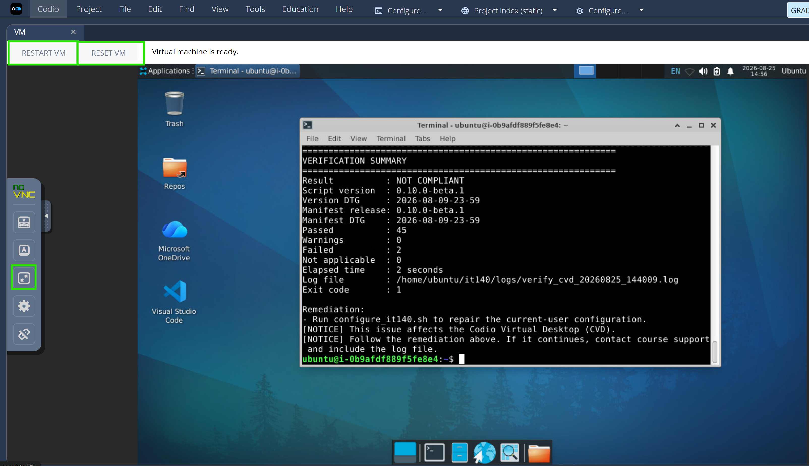

# IT 140 Environment Troubleshooting

Use this page after triage identifies the course environment as the failing
layer.

For canonical platform facts, see
[Supported Environments](../shared/supported-environments.md).

## Codio Virtual Desktop (CVD)

The CVD is the IT 140 **reference environment**. It is the best environment for
reproducing course-wide behavior because each CVD begins from a standardized
course image.

### CVD Does Not Launch

If the user cannot reach the CVD desktop:

1. Confirm the user can access the IT 140 course in Brightspace.
2. Confirm the user is launching Codio through the current course link.
3. Treat login/session/Codio launch failures through normal university-system
   support procedures.
4. If the CVD launches for other users but not this user, preserve the exact
   access error and time of failure.

Do not troubleshoot Python, GitHub CLI, or VS Code until the CVD desktop itself
is accessible.

### CVD Launches but the Course IDE Is Wrong

If the desktop appears but tools/settings are missing or incorrect:

1. Ask whether the CVD was recently **reset**. A reset returns the VM to its
   original state and requires the CVD setup/configuration process again.
2. Open a new CVD Terminal.
3. Run the supported read-only Verify procedure from
   [Verification and Logs](verification-and-logs.md#cvd-verify).
4. Follow the script's displayed remediation.
5. If the same failure remains after documented remediation, escalate with the
   Verify log/support artifact.

### CVD Update Appears Frozen

The current setup support guidance allows long quiet periods during Ubuntu
package downloads.

If no new output appears:

* keep the Terminal open;
* do not press keys or start another update;
* wait up to **30 minutes after the last new line**;
* continue waiting if new lines occasionally appear.

If there has been no new text for 30 consecutive minutes and the last line
begins with `Get:` or `Ign:`:

1. Press **Ctrl+C** once.
2. Let the script stop and display its summary.
3. Close the Terminal.
4. Open a new Terminal.
5. Run `update_it140.sh` **one more time**.

Do **not** interrupt the script while it displays `Unpacking`, `Setting up`, or
`Processing triggers`.

If the second Update run fails or repeatedly stops at the same download, stop
and escalate with the update log.

### CVD User-Interface Cautions

* Do not change noVNC controls other than the documented Full Screen control
  unless support for Codio/noVNC specifically requires it.
* Do not use Ubuntu **Shut Down** as the normal way to leave the CVD; closing
  the browser tab is sufficient.
* A normal VM restart is different from **RESET VM**. A reset destroys the
  configured VM state.

## VS Code Restricted Mode

Module One course IDE configuration is intended to trust the user's entire
`~/Repos` folder. Normally, an IT 140 activity repository under `~/Repos`
should not open in VS Code Restricted Mode after the course IDE has been
configured.

If the **Restricted Mode** warning bar appears:

1. Confirm the opened repository is the expected IT 140 local clone under
   `~/Repos`.
2. Click **Manage** on the **Restricted Mode** warning bar.
3. In **Workspace Trust**, find **Trusted Folders & Workspaces**.
4. Use the control in that section to add a trusted folder.
5. In the folder selection window, go to the user's home folder and select the
   entire **Repos** folder.

Do not disable VS Code Workspace Trust globally or instruct the user to trust
unrelated folders merely to remove the warning.

If `~/Repos` was expected to be trusted but the setting repeatedly disappears,
run the supported Verify procedure where available and follow the normal
course-IDE troubleshooting path.

See the canonical
[VS Code Restricted Mode](../shared/github-workflow.md#vs-code-restricted-mode)
guidance for the repository-workflow context.

## Windows

Use the live
[Windows Setup Guide](https://github.com/GC-STEM/it140-m1-setup-tasks/blob/main/local/windows/README.md)
for exact setup commands.

### Confirm the Context

The supported Windows workflow intentionally uses different privilege contexts:

| Lifecycle Stage | Expected Context |
| --- | --- |
| Prepare | Regular Windows PowerShell |
| Install | Administrator Windows PowerShell |
| Configure | Regular Windows PowerShell |
| Verify | Regular Windows PowerShell |
| Update | Start in regular Windows PowerShell; the script requests elevation only when needed |

> [!IMPORTANT]
> Do not run every IT 140 PowerShell command as Administrator. If Verify or
> Configure was run from an Administrator PowerShell window, close it and rerun
> the documented command from a regular PowerShell window.

<!-- screenshot placeholder; show two Windows PowerShell title bars side by
side: regular and Administrator, with the Administrator label highlighted -->

### Windows Local Setup Is Optional

If command-line tools are blocked, administrator approval is unavailable,
Windows is organization-managed in a way that blocks required software, or
local setup cannot be stabilized, use the CVD for course continuity.

Do not bypass organizational controls or disable security software to force the
local setup to work.

### Windows Course IDE Problem

For an already configured Windows course IDE:

1. Open a **regular** Windows PowerShell window.
2. Run the Windows Verify procedure from
   [Verification and Logs](verification-and-logs.md#windows-verify).
3. Read the full summary and remediation.
4. Follow only the documented remediation or
   [Safe Remediation](safe-remediation.md).

## macOS

Use the live
[macOS Setup Guide](https://github.com/GC-STEM/it140-m1-setup-tasks/blob/main/local/macOS/README.md)
for exact setup commands.

The current automated macOS path is for supported **Apple-silicon** Macs and
requires a macOS account that can authorize software installation.

### macOS Privilege Rule

Run the IT 140 lifecycle commands as the student's normal macOS Administrator
user.

Do **not** add `sudo` before Prepare, Install, Configure, Verify, or Update
commands unless future official course instructions explicitly say to do so.
The scripts request authorization when required.

### macOS Course IDE Problem

1. Open a new Terminal window as the regular course user.
2. Run the macOS Verify procedure from
   [Verification and Logs](verification-and-logs.md#macos-verify).
3. Review `COMPLIANT`/`NOT COMPLIANT`, failed checks, remediation, exit code,
   and log path.
4. Follow documented remediation and rerun Verify.
5. Escalate repeatable failures with the log.

Unsupported Intel-based Macs should use the CVD rather than attempting to force
the current Apple-silicon automation to run.

## Linux

> [!IMPORTANT]
> Follow the **live Linux setup guide** rather than assuming the Windows/macOS
> lifecycle procedure applies.

The current
[Linux Setup Guide](https://github.com/GC-STEM/it140-m1-setup-tasks/blob/main/local/linux/README.md)
uses a manual Debian-based installation procedure and currently does **not**
document the same `verify_it140` lifecycle procedure used by CVD, Windows, and
macOS.

For a current Linux support case:

1. Identify the Linux distribution and desktop environment.
2. Confirm which section of the live Linux README the user followed.
3. Preserve the exact terminal error.
4. If the documented setup command was used, collect the setup log when present
   (`~/Desktop/it140_setup_log.txt` in the current guide).
5. Do not substitute CVD, Windows, or macOS lifecycle commands.
6. Use the CVD for course continuity if Linux setup is blocking coursework.
7. Escalate a reproducible defect in the current Linux instructions as a course
   technical issue.

This branch should be revised when the Linux course automation and setup
documentation change.

## Unsupported or Best-Effort Local Environment

If the user's device or operating system is outside the current supported
automated setup guides:

* use the CVD as the recommended course environment;
* do not turn a best-effort manual configuration into an unlimited Service Desk
  engineering task;
* do not bypass device-management or security restrictions; and
* document the unsupported configuration if escalation is still needed for
  another reason.

See
[Unsupported or Best-Effort Environments](../shared/supported-environments.md#unsupported-or-best-effort-environments).

Return to the [Service Desk Triage and Escalation Runbook](README.md).
