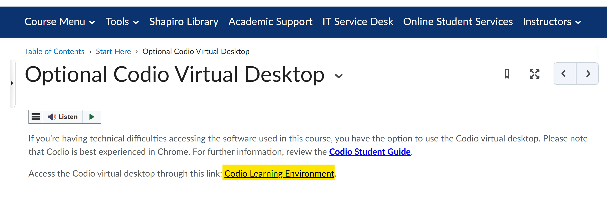

# IT 140 Service Desk Triage

Use this page to classify an IT 140 problem before attempting remediation.

The goal is to determine **what layer is failing** while preserving student
work and keeping coursework moving.

## Collect Four Facts First

Before changing anything, record:

```text
User role:
Module/activity:
Environment:
What the user was trying to do:
```

Then ask what happened and identify the first failed layer below.

## Triage Flow

```text
Can the user access the required system?
├─ No → Access or launch problem
└─ Yes
   │
   ├─ Does the course environment launch?
   │  ├─ No → Environment problem
   │  └─ Yes
   │
   ├─ Is the issue GitHub/repository related?
   │  ├─ Yes → GitHub/repository branch
   │  └─ No
   │
   ├─ Can Python run in the course environment?
   │  ├─ No → Environment/Python branch
   │  └─ Yes
   │
   └─ Does only the student's program fail or produce the wrong result?
      ├─ Yes → Faculty/Academic Support learning path
      └─ No/unclear → Run Verify where supported and collect evidence
```

If the environment is working and the remaining need is **time/task
prioritization, organization, reading/following technical directions, or
related academic skills**, route to
[Academic Coaching](../academic-support/coaching.md) rather than continuing
technical diagnostics.

## 1. Access or Launch Problem

Examples:

* cannot sign in to SNHU systems;
* cannot access Brightspace;
* Codio link does not open;
* CVD cannot be launched from the course;
* browser/session access fails before the CVD desktop appears.

Treat these first as **access/platform problems**, not Python or repository
problems.

For a missing public IT 140 GitHub resource, check the current
[Course Status](https://github.com/GC-STEM/it140/wiki/Course-Status) before
treating it as an individual-user incident.

If Brightspace or another university system is the failing layer, use the
normal approved Service Desk process for that system.



## 2. Course Environment Does Not Launch or Is Not Usable

Identify the environment:

| Environment | Next Step |
| --- | --- |
| CVD | [CVD troubleshooting](environment-troubleshooting.md#codio-virtual-desktop-cvd) |
| Windows | [Windows troubleshooting](environment-troubleshooting.md#windows) |
| macOS | [macOS troubleshooting](environment-troubleshooting.md#macos) |
| Linux | [Linux troubleshooting](environment-troubleshooting.md#linux) |
| Chromebook/tablet/unsupported OS | Use the CVD; see [Unsupported or best-effort environments](../shared/supported-environments.md#unsupported-or-best-effort-environments) |

If the problem is on a local computer, confirm whether the student can use the
CVD while the local issue is investigated. The CVD is the course reference
environment and a working local installation is optional.

If VS Code launches but the current IT 140 repository opens in **Restricted
Mode**, continue with
[VS Code Restricted Mode](environment-troubleshooting.md#vs-code-restricted-mode).

## 3. Lifecycle Script or Verification Problem

If Prepare, Install, Configure, Verify, or Update reports an unexpected result:

1. Record the lifecycle stage.
2. Capture the **complete final summary**.
3. Record the exit code when shown.
4. Record the exact log path.
5. Read the displayed **Next step**, **Remediation**, or follow-up instructions.
6. Do not guess at manual package/file repairs.

Continue with [Verification and Logs](verification-and-logs.md) or
[Safe Remediation](safe-remediation.md).

## 4. GitHub or Repository Problem

Common symptoms include:

* GitHub CLI authentication fails;
* wrong GitHub account is active;
* repository already exists;
* the activity README repository-setup command fails;
* repository cannot be cloned;
* student clicked **Fork** or **Use this template** instead of following the
  activity README setup commands;
* student cloned the public GC-STEM template instead of the private repository;
* local repository is connected to the wrong remote;
* `git pull --ff-only` or `git push` fails;
* two local copies appear to have diverged after work on more than one device;
* expected student work is missing after moving to another environment; or
* GitHub Actions behavior does not match the activity's documented student CI
  lifecycle.

Before recreating anything, identify the three copies described in
[Course Repository Architecture](../shared/course-repository-architecture.md#the-three-copy-model).

If a pull/push cannot fast-forward, **stop additional changes on all affected
local copies** until the repository state is assessed. Do not use merge, reset,
rebase, or force-push as a first-line fix.

Continue with
[GitHub and Repository Troubleshooting](github-repository-troubleshooting.md).

## 5. Python Execution Problem

Ask whether **Python itself** can run in the configured course environment.

If Python cannot launch, the configured interpreter is unavailable, or Verify
reports Python/course-IDE failures, continue with the technical environment
path.

For CVD, Windows, and macOS, use
[Verification and Logs](verification-and-logs.md) to assess the supported
environment.

If Python runs and the problem occurs only when the student's program executes,
move to the student-code branch below.

## 6. Student-Code, Learning, or Course-Content Problem

Examples:

* Python runs but reports a syntax error in the student's `.py` file;
* the program executes but produces the wrong output;
* a loop, branch, function, list, or dictionary does not behave as the student
  intended;
* a student CI check reports expected formative feedback about incomplete or
  damaged student work;
* the student does not understand the assignment requirements;
* the student wants help designing pseudocode or a flowchart;
* the student is falling behind because they cannot prioritize or organize the
  work; or
* the student struggles to read and follow technical documentation even though
  the tools work.

These are not primarily Service Desk problems.

Route according to [Support Boundaries](../shared/support-boundaries.md):

* **Faculty** — assignment requirements, grading, instructor feedback, and
  instructional questions appropriate to the instructor.
* **Academic Support learning services** — programming concepts, debugging
  approaches, testing, and problem-solving within academic-integrity
  boundaries.
* **Academic Coaching** — time/task prioritization, organization,
  technical-reading strategies, learning strategies, and related
  academic-process needs.

Use [Academic Support for IT 140](../academic-support/README.md) to select the
appropriate Academic Support service.

The Service Desk may still establish that the environment works, but should not
turn a technical ticket into completion of the student's graded code or into
academic coaching.

## 7. Course-Provided Artifact Appears Defective

Suspect a course technical defect when:

* the same supported-environment failure affects multiple users;
* a public GC-STEM README command fails as written;
* a course-provided starter file, test, script, or link is missing or malformed;
* a fresh untouched personal repository fails contrary to its documented
  student CI lifecycle;
* GitHub Actions fails during checkout/setup or several students report the
  same unexpected CI failure;
* Verify fails reproducibly in the reference CVD after documented remediation;
* course documentation and automation disagree.

Check [Course Status](https://github.com/GC-STEM/it140/wiki/Course-Status), then
follow
[Course Technical Maintenance Escalation](escalation.md#course-technical-maintenance-escalation).

## Triage Completion Criteria

Before leaving triage, you should know:

* the environment;
* the failing layer;
* whether coursework can continue in the CVD;
* whether the problem belongs to technical support or another support
  role/service; and
* which evidence must be collected next.

Return to the [Service Desk Triage and Escalation Runbook](README.md).
