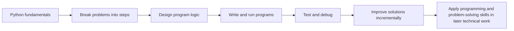

# IT 140 Course Overview

This page provides shared background about **IT 140 - Introduction to Scripting** for SNHU personnel who support the course.

You do not need to understand every course activity or programming concept to support IT 140. Use this page to understand what the course teaches, how students work, which systems they use, and where different types of course information belong.

For more detailed technical or procedural information, follow the links throughout this page.

## Course at a Glance

**IT 140 - Introduction to Scripting** is an introductory programming course that uses Python to teach foundational programming and problem-solving concepts.

The online course runs for eight weeks. Students may enter IT 140 with very different levels of previous programming and technology experience, including no previous programming experience.

Students learn progressively by reading and practicing programming concepts, designing solutions, writing Python programs, testing and debugging their work, and completing a multi-module text-based game project.

IT 140 introduces concepts such as:

* basic input and output;
* variables and data types;
* arithmetic and expressions;
* strings;
* decision branching;
* loops;
* functions;
* lists;
* dictionaries;
* files;
* classes and modules; and
* programming practices such as testing, debugging, readability, and incremental development.

> [!IMPORTANT]
> IT 140 is an introductory programming course. **Introductory means previous programming experience is not assumed; it does not mean the course requires little time or effort.**
>
> A problem that a student describes as "Python not working," "VS Code not working," or "my assignment not working" may be a technical environment problem, a repository problem, or a problem in the student's own program. Support personnel should identify which type of problem is occurring before attempting a solution or referral. See [Support Boundaries](support-boundaries.md).

## Workload Context

IT 140 is a three-credit course delivered in eight weeks. Under SNHU and applicable accreditation expectations, a three-credit course in this format should require **about 16 hours per week on average for an average student**.

Actual time varies by student and week. Students who are new to programming may need more than the average while they develop new problem-solving habits, learn the development environment, and practice debugging.

The zyBooks workload is significant throughout the course. As a practical planning estimate, students may spend approximately:

* **4–5 hours per week in zyBooks during the earlier part of the course**; and
* **2–3 hours per week in zyBooks during later weeks** as that portion of the workload tapers somewhat.

The remainder of the expected weekly time includes Brightspace course content, programming practice, design work, assignments/projects, testing and debugging, review, and obtaining help when needed. Exact weekly activities remain governed by the current Brightspace course and zyBooks assignments.

Students should plan to work on IT 140 across multiple sessions during the week rather than planning to begin all work on the weekend. Because concepts build on earlier material, delays can compound quickly.

## How Students Learn and Work

IT 140 uses several systems and resources together. No single system contains the entire course experience.

### D2L Brightspace

**D2L Brightspace is the authoritative source for graded activity requirements, submissions, grading, deadlines, and instructor feedback.**

Students should use the Guidelines and Rubric page in Brightspace to determine what a graded assignment or project requires and what they must submit.

GitHub repositories may provide starter files, working files, supporting instructions, automated checks, and other development resources, but they do not replace the Guidelines and Rubric in Brightspace.

### zyBooks

Students use the IT 140 zyBook for interactive instructional content and programming practice.

The zyBook introduces and reinforces the programming concepts used throughout the course through readings, animations, participation activities, and programming labs.

A student struggling with the meaning or application of a programming concept may need instructional or learning support rather than technical troubleshooting.

### Course GitHub Repositories

The public **GC-STEM IT 140 course repositories** provide course development-environment automation, setup instructions, starter files, activity-specific guidance, supporting resources, and GitHub-based workflows.

The GitHub repositories currently support:

| **Course Stage** | **GitHub-Supported Work** |
| --- | --- |
| Module One | Course development-environment setup |
| Module Two | Beginner Python program and IDE reflection |
| Module Three | Program design using flowcharts and pseudocode |
| Module Four | Program design using pseudocode |
| Module Five | Project One game design |
| Module Six | Simplified game prototype milestone |
| Module Seven | Project Two final text-based game |

Modules Five through Seven use a single project repository so students can carry their design, prototype, and final implementation through successive stages of development.

See [Course Repository Architecture](course-repository-architecture.md) for the purpose and relationship of each course repository.

### Student GitHub Repositories

For assignments and projects that use GitHub templates, students work from their own **private GitHub repositories** created from the current public IT 140 course templates.

The public `GC-STEM` repository contains the course-provided starting point. The student's private repository contains the student's working copy and may contain graded work.

Students typically clone their private repositories into the course development environment, work on files in VS Code, and use Git to save changes and GitHub to maintain a remote copy of their work.

GitHub is part of the student's development workflow. **GitHub does not submit an assignment for grading.**

See [GitHub Workflow](github-workflow.md) for the shared IT 140 repository workflow and terminology.

## Course Development Environment

IT 140 uses a standardized collection of development tools referred to in course documentation as the **course IDE**.

The course IDE includes the primary tools students need to design, write, run, test, debug, and manage their course work. The toolset includes VS Code, Python, Git, GitHub tools, testing tools, and course-related VS Code extensions.

The **Codio Virtual Desktop (CVD)** is the IT 140 reference environment. Course screenshots, videos, instructions, and support procedures may use the CVD as their reference point.

Students may also configure the course IDE on a supported local:

* Windows computer;
* macOS computer; or
* Linux computer.

The same core toolset is used across supported environments, but local computers can differ because of existing software, operating-system configuration, permissions, security controls, and other user-specific conditions.

For supported-platform details and environment expectations, see [Supported Environments](supported-environments.md).

## Course Development Progression

IT 140 intentionally moves students from small programming tasks toward increasingly complete software solutions.

Early work emphasizes basic programming concepts and becoming comfortable with the development environment.

The course repositories also introduce a simplified software-development workflow in which students encounter activities such as:

> **Analyze → Design → Construct → Test**

Students apply these practices with increasing independence as the course progresses.

The multi-module project provides a clear example of this progression:

* **Project One - Design:** Students design a text-based adventure game, including its theme, rooms, items, map, and pseudocode.
* **Module Six Milestone - Prototype:** Students develop a simplified version that lets a player move among a small set of rooms and exit the game.
* **Project Two - Implementation:** Students develop the complete text-based game using their earlier design work and programming concepts including functions, dictionaries, loops, decision branching, input validation, and debugging.

This progression matters when supporting students. A design file, prototype, or partially working program may be intentionally incomplete because it represents a particular stage of the development process.

## Why IT 140 Matters Beyond This Course

IT 140 develops skills that students reuse in later technical coursework and practical problem solving. The course is not only about learning Python syntax.

Students practice how to:

* translate a problem into explicit steps;
* organize a solution before and while coding;
* read and write program logic;
* test assumptions and diagnose errors;
* revise a solution incrementally; and
* use common development tools and workflows.

These habits support later coursework and technical projects even when a later course uses different languages, tools, or problem domains.

## The Course Repository Is Not the Student's Repository

Support personnel should distinguish among:

* the **public IT 140 course repositories** maintained by GC-STEM;
* the **student's private GitHub repositories** created from course templates; and
* the **local cloned repositories** stored in the student's course development environment.

These repositories may have similar or identical names but serve different purposes.

For example, `GC-STEM/it140-m2-assignment` is the public course template. A student may also have a private repository named `it140-m2-assignment` in their own GitHub account and a local folder with the same name on their CVD or computer.

Confusing these copies can lead to incorrect troubleshooting steps.

See [Course Repository Architecture](course-repository-architecture.md) and [GitHub Workflow](github-workflow.md) before providing repository-specific instructions.

## What Supporters Need to Recognize

Support personnel do **not** need to become Python instructors to support IT 140 effectively.

The most important first distinction is whether the student is experiencing a problem with:

* access to a course system;
* the course development environment;
* Git or GitHub;
* a course or student repository;
* running Python;
* a course-provided file or tool;
* understanding a programming concept;
* the logic or syntax of the student's own code;
* assignment requirements or grading; or
* another course-related concern.

Different problems belong to different support roles.

As a general orientation:

* **IT Service Desk personnel** primarily diagnose technical access and environment problems.
* **Faculty** address course requirements, grading, instructor feedback, and instructional concerns.
* **Learning Support Specialists (LSS)** help students develop understanding and problem-solving skills within appropriate academic-integrity boundaries.
* **Academic Advisors** help students with academic planning, course expectations, and referrals to the appropriate support resource.

These are broad boundaries rather than complete procedures. See [Support Boundaries](support-boundaries.md) for the canonical support-responsibility guidance.

## When Technical Troubleshooting Is Appropriate

A technical problem may involve symptoms such as:

* a supported course environment does not launch or configure correctly;
* a course development tool is unavailable;
* GitHub authentication fails;
* a repository cannot be created, cloned, opened, or accessed as expected;
* Python cannot run in the configured course environment;
* course verification reports a failure or unexpected result; or
* a course-provided script, file, or repository does not behave as documented.

A program that runs but produces incorrect results is not automatically a technical environment problem. The issue may instead be in the student's code.

Do not make broad changes to a student's development environment simply because a Python program is not producing the expected result.

## Source of Truth by Question

Use the source that matches the question being answered.

| Question | Primary Source |
| --- | --- |
| What does a graded activity require? | D2L Brightspace Guidelines and Rubric |
| What must the student submit? | D2L Brightspace Guidelines and Rubric |
| How is an activity graded? | D2L Brightspace rubric and instructor feedback |
| What programming concepts is the student studying? | D2L course content and zyBooks |
| How should the course IDE be configured? | IT 140 setup and course-environment documentation |
| How should a course repository be used? | README and supporting documentation for that repository |
| Is a course resource currently available or known to have an issue? | Current IT 140 course-status information |
| Who should handle a particular support problem? | [Support Boundaries](support-boundaries.md) |
| What information should accompany an escalation? | [Escalation Model](escalation-model.md) |

> [!NOTE]
> If information in a support guide appears to conflict with the current Guidelines and Rubric for a graded activity, do not reinterpret the assignment from the support documentation. Use the Guidelines and Rubric as the authoritative source for the activity and report the documentation conflict through the appropriate support path.

## Related Shared Documentation

Continue to the shared page that matches the information you need:

* [Course Repository Architecture](course-repository-architecture.md) - how the IT 140 repositories relate to one another
* [Course Glossary](glossary.md) - abbreviations and technical terms used across the IT 140 repository ecosystem
* [Supported Environments](supported-environments.md) - CVD and supported local environments
* [GitHub Workflow](github-workflow.md) - common GitHub and student-repository workflow
* [Support Boundaries](support-boundaries.md) - responsibilities and referral boundaries
* [Escalation Model](escalation-model.md) - evidence and escalation principles

Return to the [Shared Documentation Index](README.md) or the [IT 140 Support home page](../README.md).
